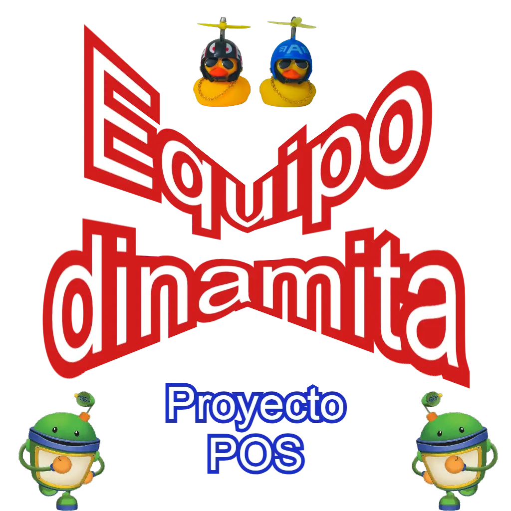

## Descripción de proyecto
El proyecto se basa en realizar un punto de venta (POS point of sale).

Este proyecto se realiza utilizando los siguientes aspectos:
 - **Framework:** [Página de Laravel](https://laravel.com)
 - **Librería 1:** [Página de Bootstrap](https://getbootstrap.com)

## Enlaces del proyecto
 - [Sistema](https://posenlinea.net)
 - [Repositorio](https://github.com/proyecto-dinamita/proyecto_pos)
 - [Archivos adjuntos en drive](https://drive.google.com/drive/folders/1e172nlWz9hjF8upkPouIMqvHJYhtvtiG?usp=share_link)
 - [Control con leantime](https://leantime.posenlinea.net)
 - **Bajo revisión =>**[Diagramació con PlantUML](https://plantuml.com/es/)

## Licencias

- **Laravel emplea la licencia [MIT licence](https://opensource.org/licenses/MIT)**

## Anexos

